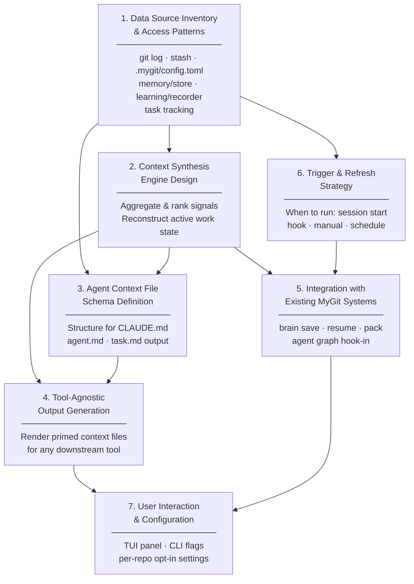

# Git Brain — Feature Design

> Context-awareness tool that reads commits, stash, and stored project data to reconstruct what was being worked on, then primes all agent context files (`CLAUDE.md`, `agent.md`, `task.md`) for the next session across any tool.

## Design Flowchart

## Node Descriptions

| # | Node | Depends On | Purpose |
|---|------|-----------|---------|
| 1 | Data Source Inventory | — | Catalog all readable data sources and their refresh rates |
| 2 | Context Synthesis Engine | 1 | Aggregate signals into a ranked reconstruction of active work |
| 3 | Agent Context File Schema | 1, 2 | Define the output structure written to context files |
| 4 | Tool-Agnostic Output Generation | 2, 3 | Render context files usable by Claude Code, Cursor, etc. |
| 5 | Integration with Existing MyGit Systems | 2, 6 | Hook into `brain save/resume/pack` and agent graph |
| 6 | Trigger & Refresh Strategy | 1 | Define when Brain runs: session hooks, manual, or scheduled |
| 7 | User Interaction & Configuration | 4, 5 | TUI panel, CLI flags, per-repo opt-in |
