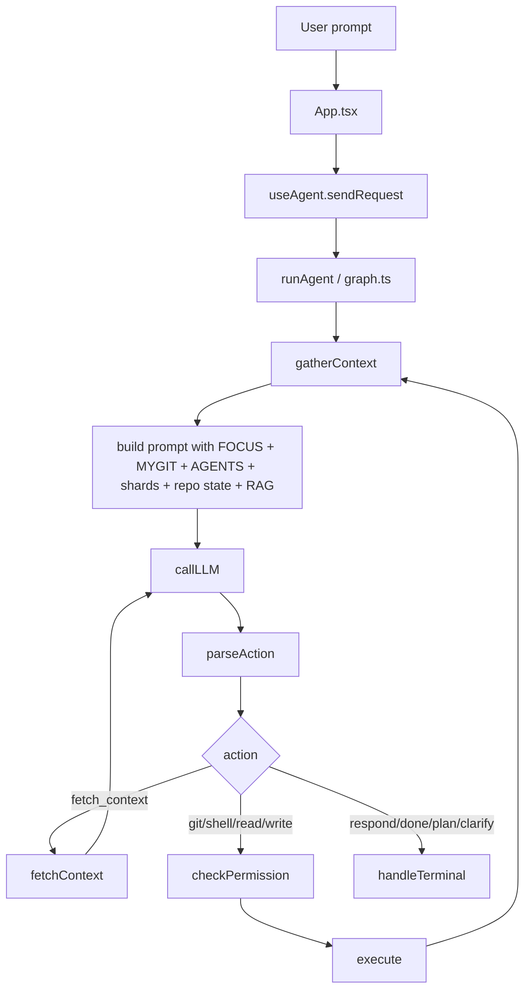
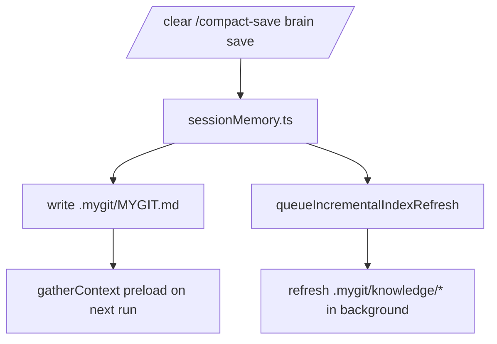
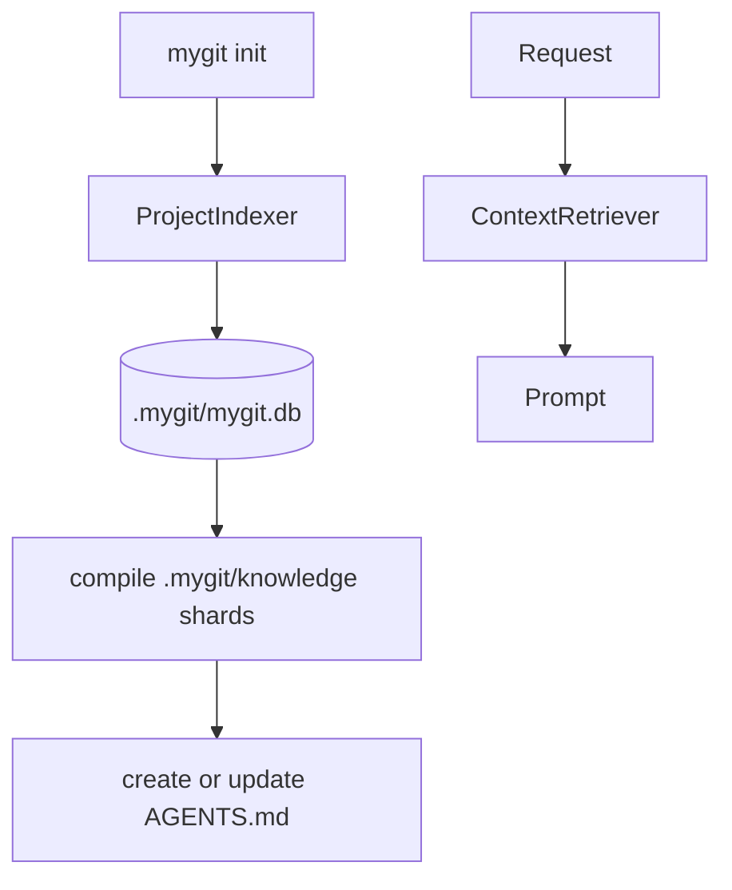

# CLAUDE.md

This file gives Claude Code a practical map of the current mygit codebase.

All active development is in `src-ts/`. The Rust tree in `src/` is legacy.

---

## Project Identity

mygit is a terminal-native AI coding assistant for Git workflows. It combines:

- a React Ink TUI
- a LangGraph agent loop
- BM25 + SQLite repo retrieval
- a managed `AGENTS.md` repo map plus deterministic `.mygit/knowledge/` shard docs
- canonical repo-local session memory in `.mygit/MYGIT.md`
- planning, PR review, merge-conflict, and worktree flows

---

## Build / Test

```bash
cd src-ts

bun run dev
bun run build
bun run typecheck
bun run test
```

Common commands:

```bash
cd src-ts

bun run index.tsx                  # launch TUI
bun run index.tsx init             # build or refresh repo index
bun run index.tsx check            # provider checks
```

---

## CLI Surface

```bash
mygit                              # interactive TUI
mygit tui --model <model>          # TUI with temporary model override

mygit init                         # smart-context indexing
mygit init --status                # index stats + staleness report
mygit init --check                 # staleness report without recompiling
mygit init --clear
mygit init --batch <n>

mygit pr list
mygit pr review <number>
mygit pr review <number> --post
mygit pr post <number>

mygit conventions discover|show|clear
mygit worktree list|add|remove|prune

mygit config show|init|edit
mygit setup
mygit check

mygit brain save [note]
mygit brain resume
mygit brain pack
```

---

## Project Knowledge And State

| Path | Meaning |
| --- | --- |
| `AGENTS.md` | tracked repo map used as the first knowledge entrypoint |
| `.mygit/config.toml` | project-level config overrides |
| `.mygit/mygit.db` | SQLite index + cache + workflow persistence |
| `.mygit/knowledge/manifest.json` | shard registry and ownership metadata |
| `.mygit/knowledge/*.md` | generated deterministic shard docs |
| `.mygit/MYGIT.md` | canonical durable latest/recent session memory |
| `.mygit/FOCUS.md` | human-authored high-priority instructions |
| `.mygit/LESSONS.md` | auto-captured cross-session failure lessons (append-only, 2KB cap) |

Important: `.mygit/MYGIT.md` is the current memory contract. `brain.json` is legacy import-only.

---

## Main Runtime Flows

### 1. Normal Request Flow



### 2. Checkpoint Memory Flow



### 3. Index / Retrieval Flow



For the comprehensive diagrams, read [docs/architecture.md](./docs/architecture.md).

---

## Source Map

### `src-ts/agent/`

- `graph.ts` — LangGraph node orchestration
- `protocol.ts` — action schemas, task-mode inference, system prompt
- `context.ts` — git state + prompt memory formatting
- `permissions.ts` — action classification and approval logic
- `events.ts` — typed event bus between graph and TUI

### `src-ts/tui/`

- `App.tsx` — TUI state machine
- `hooks/useAgent.ts` — agent lifecycle, chat state, compact/clear checkpoints
- `hooks/useThoughtMap.ts` — planning DAG lifecycle
- `thoughtMap/*` — render, LLM generation, implementation conversion
- `components/*` — chat, status, approvals, PR/merge/worktree panels

### `src-ts/context/`

- `indexer.ts` — full build + targeted refresh of BM25 summaries
- `retriever.ts` — ranked summary retrieval
- `autoIndex.ts` — async touched-file refresh after checkpoints
- `budget.ts` — prompt budget helpers

### `src-ts/knowledge/`

- `compiler.ts` — deterministic shard compilation
- `store.ts` — manifest, AGENTS ownership, and filesystem management
- `selector.ts` — request-to-shard selection
- `types.ts` — manifest and shard contracts

### `src-ts/memory/`

- `sessionMemory.ts` — canonical checkpoint pipeline
- `capture.ts` — shell/git snapshot capture used by the brain save flow

### `src-ts/cli/`

- `index.ts` — command registration
- `brain.ts` — memory save/resume/pack
- `pr.ts` — PR list/review/post
- `agent.ts`, `plan.ts`, `git.ts`, `conflicts.ts`, `worktree.ts`, `conventions.ts`

### `src-ts/harness/`

- `lessons.ts` — cross-session failure feedback loop (capture + load `.mygit/LESSONS.md`)
- `staleness.ts` — knowledge shard staleness detection (full + quick checks)

### `src-ts/recipes/`

- `types.ts` — recipe, match, and enhanced git context type contracts
- `catalog.ts` — 15 structured git workflow recipes (cross-repo, history, search, branch, setup)
- `matcher.ts` — regex-scored request matching, parameter extraction, prompt formatting
- `context.ts` — enhanced git context gathering (remotes, tracking, branches, fork info)

### `src-ts/pr/` and `src-ts/github/`

- PR analysis, cache, GitHub fetching/posting

### `src-ts/storage/`

- `database.ts` — SQLite schema and accessors

---

## Implementation Notes

- The system prompt is now inspect-first: preload memory and RAG context, then fetch or read only when necessary.
- Prompt preload now includes `AGENTS.md` and 1-2 selected shard docs before new reads.
- `fetch_context` is free with a cap; repeated `read_file` / `fetch_context` actions are blocked by the loop guard.
- Direct Q&A still receives latest memory from `MYGIT.md`, but with smaller prompt budgets than execution mode.
- `sessionMemory.ts` now owns `MYGIT.md` parse/write, legacy `.mygit/brain.json` import, portable pack output, and fallback checkpoint summaries when no model is available.
- `context.autoIndex` is active now, but only refreshes touched files and deterministic knowledge artifacts if an index already exists.
- `mygit init` is the public index + knowledge-map command. `mygit index` remains only as a deprecated hidden alias.
- Git Recipes: complex git workflows (fork sync, cross-repo fetch, history ops, branch search) are supported via optional recipe guidance injected into the system prompt. Enhanced git context (remotes, tracking, fork info) is gathered for any git-heavy request. See `src-ts/recipes/`.
- Harness Engineering: prompt context is ordered KV-cache-friendly (stable RAG first, volatile git state last). Shard selection uses git-diff-aware scoring alongside keyword/profile matching. Agent failures are captured to `.mygit/LESSONS.md` for cross-session learning. Knowledge staleness is detected via commit count and source path checks. See `src-ts/harness/`.

---

## Useful Docs

- [README.md](./README.md)
- [docs/architecture.md](./docs/architecture.md)
- [docs/development.md](./docs/development.md)
- [docs/configuration.md](./docs/configuration.md)
- [src-ts/docs/agent-loop.md](./src-ts/docs/agent-loop.md)
- [benchmarks/README.md](./benchmarks/README.md)

---

## Benchmark Assets

- `benchmarks/mygit-hybrid-benchmark-v1.jsonl` — 220-case hybrid benchmark catalog for prompt-only, agent-in-loop, and end-to-end evaluation
- `benchmarks/mygit-hybrid-fixtures.json` — reusable fixture-state definitions for the benchmark catalog
- `benchmarks/README.md` — benchmark taxonomy, scoring profiles, and record format
