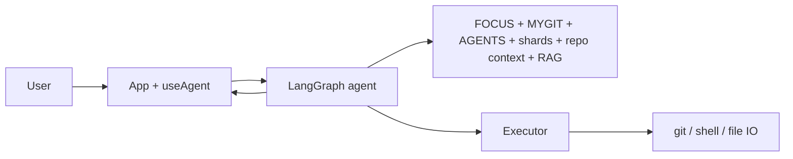
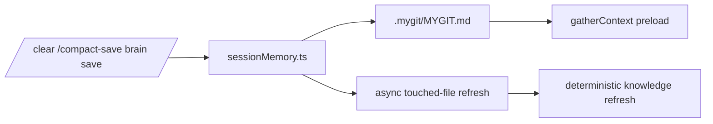
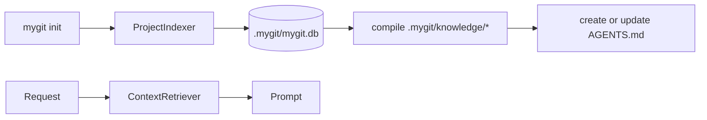
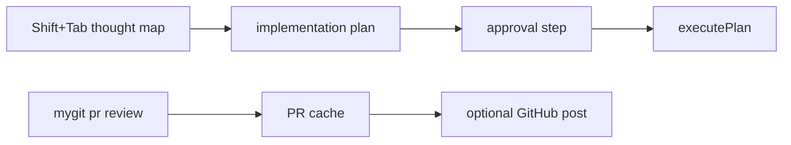

# Project Summary: mygit

mygit is a terminal-native AI coding assistant focused on Git-centric development workflows. The current product is the TypeScript/Bun implementation in `src-ts/`.

---

## What It Does

- interactive React Ink TUI for agentic workflows
- LangGraph-based execution loop with permission gating
- BM25 + SQLite repo retrieval for low-latency code context
- managed `AGENTS.md` repo map plus deterministic `.mygit/knowledge/` shard docs
- canonical repo-local working memory in `.mygit/MYGIT.md`
- thought-map planning flow before implementation
- GitHub PR review, caching, and optional posting
- merge-conflict parsing and smart-resolution flows

---

## Main Working Flows

### 1. Request Execution

### 2. Session Memory

### 3. Repo Context / RAG

### 4. Planning + Review

---

## Runtime Layout

| Layer | Main files |
| --- | --- |
| CLI + entry | `src-ts/index.tsx`, `src-ts/cli/*` |
| TUI | `src-ts/tui/App.tsx`, `src-ts/tui/components/*`, `src-ts/tui/hooks/*` |
| Agent | `src-ts/agent/graph.ts`, `src-ts/agent/protocol.ts`, `src-ts/agent/context.ts` |
| RAG | `src-ts/context/indexer.ts`, `src-ts/context/retriever.ts`, `src-ts/context/autoIndex.ts` |
| Knowledge | `src-ts/knowledge/*` |
| Memory | `src-ts/memory/sessionMemory.ts` |
| Persistence | `src-ts/storage/database.ts` |
| PR / GitHub | `src-ts/pr/*`, `src-ts/github/*` |
| Merge | `src-ts/merge/*` |

---

## Key Project Surfaces

- `AGENTS.md` — tracked repo map entrypoint
- `.mygit/config.toml` — project configuration
- `.mygit/mygit.db` — SQLite persistence
- `.mygit/knowledge/manifest.json` — shard registry
- `.mygit/knowledge/*.md` — generated deterministic shard docs
- `.mygit/MYGIT.md` — canonical latest + recent session memory
- `.mygit/FOCUS.md` — human-authored priority instructions

---

## Where To Read Next

- [README.md](./README.md) for the user-facing overview
- [docs/architecture.md](./docs/architecture.md) for the full flowchart explanation
- [docs/development.md](./docs/development.md) for contributor workflows
