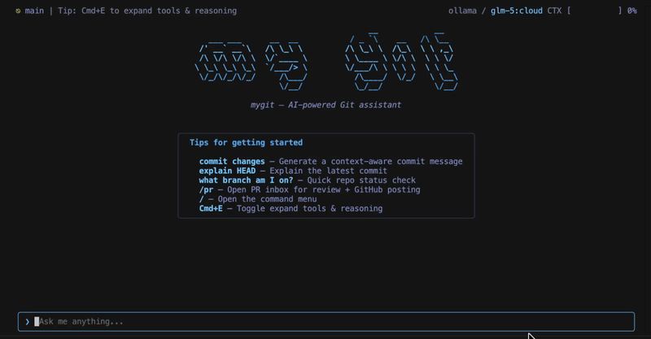

# MyGit

> A terminal-native AI coding assistant for Git workflows — React Ink TUI, LangGraph agent loop, BM25 smart-context retrieval, and durable repo-local session memory.




---

## What is MyGit

MyGit is a local-first developer assistant that keeps your Git workflows inside the terminal. Ask it to commit, review PRs, resolve merge conflicts, search history, or execute multi-step coding tasks — all with a permission-gated agent loop that shows its work before acting.

It runs fully offline with Ollama, LM studio, HuggingFace or connects to any API-backed LLM. Context is built once with `MyGit init` and retrieved on every request, so you get fast, accurate answers without re-reading files every turn.


---

## Features

| Feature | Description |
| --- | --- |
| **Interactive TUI** | Animated chat, tool rows, approval prompts, slash command palette, and multi-panel modes |
| **Agent Loop** | LangGraph StateGraph with parse retries, loop guard, cancellation, and permission tiers |
| **Smart Context** | BM25 + SQLite retrieval — index once, ranked context on every request |
| **Knowledge Map** | Managed `AGENTS.md` repo map + deterministic `.MyGit/knowledge/` shard docs |
| **Session Memory** | Durable `Last` / `Next` working memory in `.MyGit/MyGit.md` across sessions |
| **Thought Map** | Shift+Tab planning mode — generate a DAG, refine, then hand off to the agent |
| **PR Review** | GitHub fetch, AI analysis with inline comments, SQLite cache, optional post-back |
| **Merge Conflicts** | Two-pane conflict view, accept-ours / accept-theirs, LLM-assisted smart merge |
| **Git Recipes** | 15+ structured workflows: cross-repo fetch, history search, fork sync, branch ops |
| **Cross-Branch Search** | Find which branch introduced a feature, deleted a file, or contains a commit |
| **Harness Engineering** | Cross-session failure lessons, staleness detection, KV-cache-friendly prompting |

---

## How It Works — Under the Hood

**Agent loop**: Every request runs through a LangGraph StateGraph. MyGit gathers context (git state, memory, RAG results), calls the LLM, parses the action, checks permissions, and executes — looping back until the task is done or the budget is reached. Destructive actions always require explicit user approval.


**Smart context (RAG + knowledge)**: `MyGit init` builds a BM25 inverted index from your codebase and generates focused shard docs in `.MyGit/knowledge/`. On every request a multi-factor scorer selects the most relevant shards and RAG chunks, injects them into the prompt, and keeps the context window lean. Shards auto-refresh after checkpoints.

**Session memory**: After each session, `/compact-save` or `MyGit brain save` writes a `Last` / `Next` summary to `.MyGit/MyGit.md`. The next session picks this up automatically in `gatherContext` — so a cleared conversation still knows the current project state. `.MyGit/FOCUS.md` lets you pin permanent high-priority instructions.

For full system diagrams and flow charts see [docs/architecture.md](docs/architecture.md).

---

## Installation

### Prerequisites

- [Bun](https://bun.sh) 1.1+
- Git
- One LLM provider: **Ollama** for local/offline use, or any API-backed provider

### Setup

```bash
git clone <repo-url>
cd MyGit/src-ts
bun install

# Run directly
bun run dev
```

### First-Time Project Setup

```bash
# Interactive setup wizard
MyGit setup

# Build the smart-context index and knowledge map
MyGit init
```

---

## Commands

```bash
# Interactive TUI
mygit
mygit tui --model <model>

# Smart-context index
mygit init
mygit init --status          # Index stats + staleness report
mygit init --check           # Staleness check without recompiling
mygit init --clear
mygit init --batch <n>

# PR review
mygit pr list
mygit pr review <number>
mygit pr review <number> --post
mygit pr post <number>

# Conventions / worktrees
mygit conventions discover|show|clear
mygit worktree list|add|remove|prune

# Config / utilities
mygit config show|init|edit
mygit setup
mygit check

# Brain / memory
mygit brain save [note]
mygit brain resume
mygit brain pack
```

---

## TUI Shortcuts

| Key | Action |
| --- | --- |
| `Enter` | Submit input |
| `Ctrl+C` | Cancel running agent or exit |
| `Shift+Tab` | Toggle thought-map planning mode |
| `/` | Open slash command palette |
| `Cmd+E` / `Ctrl+E` | Expand or collapse tool/reasoning rows |
| Mouse wheel | Scroll chat |
| `Escape` | Back out of dialogs and panels |

---

## Configuration

Config merges in this order (later overrides earlier):

1. Built-in defaults
2. Global config (`~/.config/MyGit/config.toml`)
3. Repo-local `.MyGit/config.toml`
4. Environment variables

```toml
provider = "ollama"

[ollama]
url = "http://localhost:11434"
model = "qwen2.5-coder:7b"
temperature = 0.4
contextWindow = 16384

[context]
enabled = true
autoIndex = true
retrievalTopK = 5
contextBudgetRatio = 0.25
```

See [docs/configuration.md](docs/configuration.md) for the full reference.

---

## Persistence

| Surface | Location | Purpose |
| --- | --- | --- |
| Root agent map | `AGENTS.md` | Tracked repo map and shard entrypoint |
| Database | `.MyGit/MyGit.db` | BM25 index, conventions, workflows, PR cache |
| Knowledge store | `.MyGit/knowledge/*.md` | Generated shard docs |
| Working memory | `.MyGit/MyGit.md` | Latest + recent session summary |
| Focus file | `.MyGit/FOCUS.md` | Highest-priority human-authored instructions |
| Failure lessons | `.MyGit/LESSONS.md` | Cross-session failure patterns (2KB cap) |
| Repo config | `.MyGit/config.toml` | Project-level overrides |

---

## Documentation

- [docs/architecture.md](docs/architecture.md) — full system diagrams and flow charts
- [docs/development.md](docs/development.md) — contributor guide and module ownership
- [docs/configuration.md](docs/configuration.md) — config hierarchy and all settings
- [benchmarks/README.md](benchmarks/README.md) — benchmark taxonomy and scoring

---

*Built with TypeScript, React Ink, LangGraph, BM25, and SQLite. Runs on Bun.*
