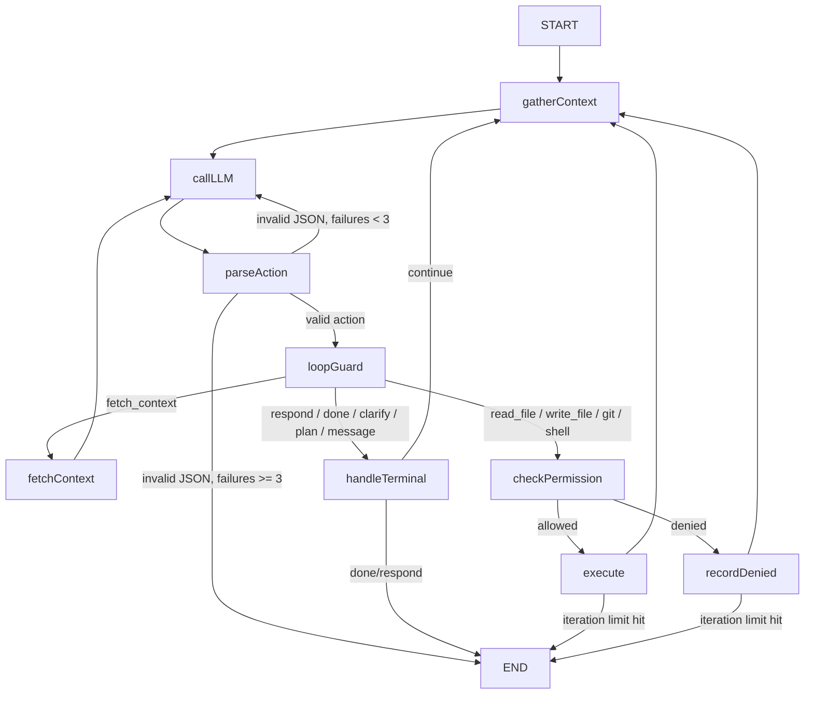
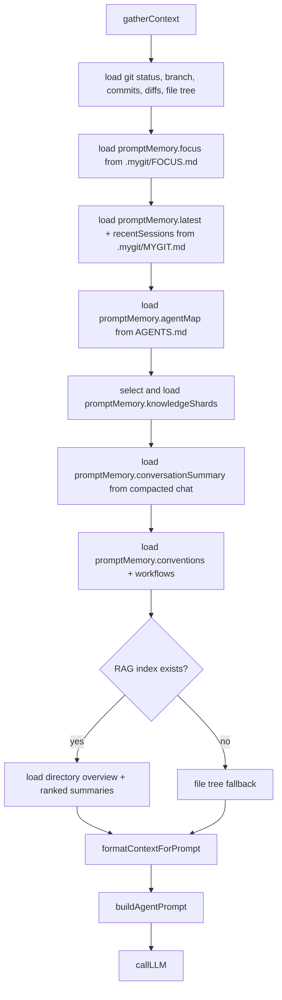
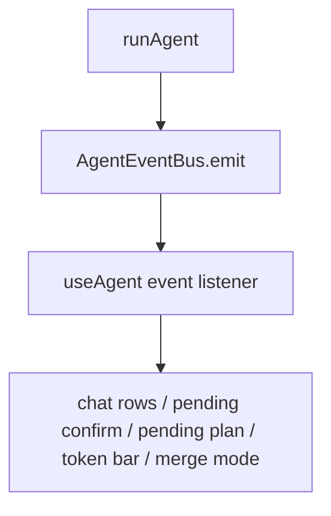

# MyGit Agent Loop

This document focuses only on the LangGraph agent loop in `src-ts/agent/graph.ts`.

For the full product architecture, see [`docs/architecture.md`](../../docs/architecture.md).

---

## Node Map

| Node | Purpose |
| --- | --- |
| `gatherContext` | Refresh repo state and assemble prompt memory (`FOCUS.md`, `MYGIT.md`, `AGENTS.md`, selected shard docs, compacted summary, conventions, workflows, RAG preload) |
| `callLLM` | Build system prompt + formatted context + runtime state and invoke the model |
| `parseAction` | Extract one JSON envelope and validate it with `AgentResponseSchema` |
| `loopGuard` | Block repeated `read_file` / `fetch_context` loops and stop hard repeats |
| `fetchContext` | Retrieve indexed context without consuming a normal iteration |
| `checkPermission` | Ask the permission manager whether execution is allowed |
| `execute` | Run git/shell/file actions and append observations |
| `recordDenied` | Add a denial observation so the model can adapt |
| `handleTerminal` | Resolve `respond`, `done`, `clarify`, `plan`, and `message` actions |

---

## Loop Flow



---

## Prompt Assembly Flow



## Inspect-First Policy

The system prompt is designed so the model should:

1. use the preloaded memory, `AGENTS.md`, selected shard docs, and RAG summaries first
2. prefer a single `fetch_context` if implementation detail is missing
3. use a single targeted `read_file` only if still blocked
4. move to `respond`, `plan`, or execution as soon as it has enough context

---

## State Channels

```ts
request: string
maxIterations: number
dryRun: boolean
showThinking: boolean

context: AgentContextState
iteration: number
parseFailures: number
done: boolean

currentAction: AgentAction | null
currentReasoning: string
llmRawResponse: string

permissionDecision: "allowed" | "denied" | "need_prompt"
lastActionSignature: string
repeatCount: number
fetchCount: number
```

### `AgentContextState`

Important parts of the context object:

- repo state: `repoRoot`, `branch`, `status`, `recentCommits`, `diffSummary`, `stagedSummary`
- prompt memory: `focus`, `latest`, `recentSessions`, `agentMap`, `knowledgeShards`, `conversationSummary`, `conventions`, `workflows`
- retrieval preload: `ragSummaries`, `directoryOverview`
- runtime observations: `observations`, `planSteps`

---

## Event Flow



### Main Events

| Event | Used for |
| --- | --- |
| `thinking` | reasoning stream / spinner |
| `action` | tool-row creation |
| `execution_result` | tool output completion |
| `action_request` | permission prompt |
| `plan_proposal` | plan approval UI |
| `clarify_request` | question UI |
| `context_fetch` | silent RAG fetch bookkeeping |
| `token_usage` | status bar + auto-compaction trigger |
| `merge_conflicts` | conflict-resolution handoff |
| `response` / `task_complete` | final user-visible completion |

---

## Guardrails

| Guardrail | Behavior |
| --- | --- |
| JSON parse retry | up to 3 attempts with stronger feedback |
| repeated `read_file` | converted into loop-guard observation, not re-executed |
| repeated `fetch_context` | converted into loop-guard observation, not re-executed |
| fetch cap | max 5 free fetches per cycle |
| iteration cap | stop with explicit error after `maxIterations` |
| cancellation | abort signal exits early from active nodes |
| silent context actions | read-only git inspection does not spam the chat |

---

## Checkpoint Integration

The agent loop itself does not write durable memory. Checkpoints happen outside the graph in `useAgent.ts` and `cli/brain.ts`, then feed back into the next `gatherContext` pass through `MYGIT.md`; when the repo already has a knowledge store, the same checkpoint refresh path also rebuilds `.mygit/knowledge/*` in the background.
