# Architecture

This document is the canonical description of how mygit works at runtime.

All active implementation lives in `src-ts/`. The legacy Rust tree in `src/` is archived and not part of the current runtime.

---

## System Map

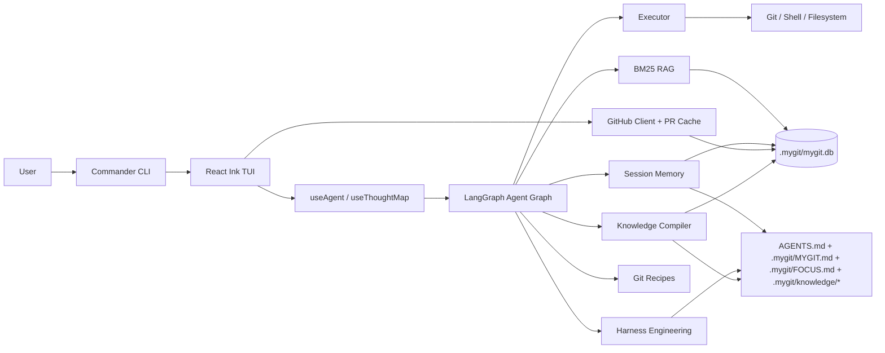
```mermaid
flowchart LR
    User[User]
    CLI[Commander CLI]
    TUI[React Ink TUI]
    Hooks[useAgent / useThoughtMap]
    Graph[LangGraph Agent Graph]
    Exec[Executor]
    Git[Git / Shell / Filesystem]
    RAG[BM25 RAG]
    Knowledge[Knowledge Compiler]
    Memory[Session Memory]
    Harness[Harness Engineering]
    Recipes[Git Recipes]
    DB[(.mygit/mygit.db)]
    Files[AGENTS.md + .mygit/MYGIT.md + .mygit/FOCUS.md + .mygit/knowledge/*]
    GitHub[GitHub Client + PR Cache]

    User --> CLI
    CLI --> TUI
    TUI --> Hooks
    Hooks --> Graph
    Graph --> Exec
    Exec --> Git
    Graph --> RAG
    Graph --> Knowledge
    Graph --> Recipes
    RAG --> DB
    Graph --> Memory
    Graph --> Harness
    Memory --> Files
    Memory --> DB
    Harness --> Files
    TUI --> GitHub
    GitHub --> DB
    Knowledge --> DB
    Knowledge --> Files
```

## Core Runtime Units

| Area | Main files | Responsibility |
| --- | --- | --- |
| Entry + command routing | `src-ts/index.tsx`, `src-ts/cli/index.ts` | Launch TUI, register CLI commands, initialize config |
| Interactive UI | `src-ts/tui/App.tsx`, `src-ts/tui/hooks/useAgent.ts` | Input handling, mode switching, event-driven rendering |
| Agent loop | `src-ts/agent/graph.ts`, `src-ts/agent/protocol.ts`, `src-ts/agent/context.ts` | Context gathering, prompt construction, action parsing, execution loop |
| Execution | `src-ts/executor/index.ts` | Run git, shell, file read/write actions |
| RAG | `src-ts/context/indexer.ts`, `src-ts/context/retriever.ts`, `src-ts/context/autoIndex.ts` | Index repo, retrieve summaries, refresh touched files |
| Knowledge map | `src-ts/knowledge/*` | Compile deterministic shard docs, manage `AGENTS.md`, select shard context |
| Memory | `src-ts/memory/sessionMemory.ts` | Build checkpoint summaries, manage `.mygit/MYGIT.md`, legacy import |
| Harness | `src-ts/harness/lessons.ts`, `src-ts/harness/staleness.ts` | Cross-session failure capture, knowledge staleness detection |
| Recipes | `src-ts/recipes/catalog.ts`, `src-ts/recipes/matcher.ts`, `src-ts/recipes/context.ts` | Structured git workflow guidance, recipe matching, enhanced git context |
| Persistence | `src-ts/storage/database.ts` | SQLite storage for context index, conventions, workflows, PR cache |
| Thought map | `src-ts/tui/hooks/useThoughtMap.ts`, `src-ts/tui/thoughtMap/*` | Planning-mode DAG generation and refinement |
| PR review | `src-ts/cli/pr.ts`, `src-ts/pr/*`, `src-ts/github/*` | Fetch PRs, analyze files, cache/post reviews |
| Merge workflows | `src-ts/merge/*`, `src-ts/tui/components/Merge*` | Parse conflicts, smart resolution, review UI |

---

## Flow 1: Normal Request Execution

This is the default path when the user types a prompt in the TUI.

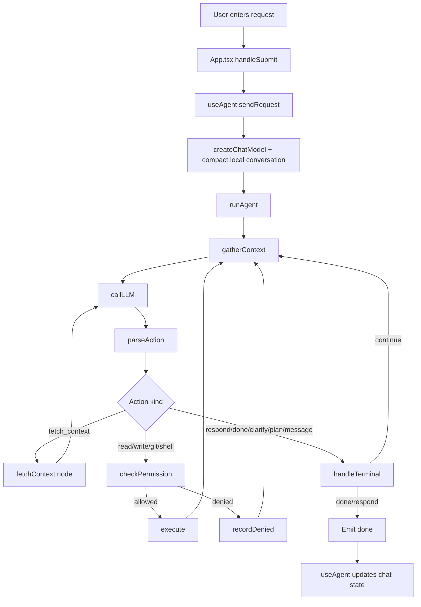
```mermaid
flowchart TD
    A[User enters request] --> B[App.tsx handleSubmit]
    B --> C[useAgent.sendRequest]
    C --> D[createChatModel + compact local conversation]
    D --> E[runAgent]
    E --> F[gatherContext]
    F --> G[callLLM]
    G --> H[parseAction]
    H --> I{Action kind}
    I -->|fetch_context| J[fetchContext node]
    I -->|read/write/git/shell| K[checkPermission]
    I -->|respond/done/clarify/plan/message| L[handleTerminal]
    J --> G
    K -->|allowed| M[execute]
    K -->|denied| N[recordDenied]
    M --> F
    N --> F
    L -->|continue| F
    L -->|done/respond| O[Emit done]
    O --> P[useAgent updates chat state]
```

### Agent Loop State Machine — All Nodes

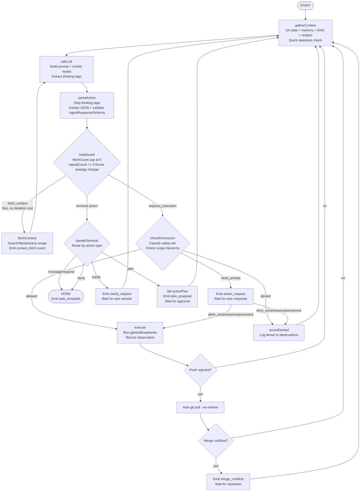
```mermaid
flowchart TD
    START([START]) --> gatherContext
    gatherContext[gatherContext\nGit state + memory + RAG + recipes\nQuick staleness check] --> callLLM
    callLLM[callLLM\nBuild prompt + invoke model\nExtract thinking tags] --> parseAction
    parseAction[parseAction\nStrip thinking tags\nExtract JSON + validate AgentResponseSchema] --> loopGuard

    loopGuard{loopGuard\nfetchCount cap at 5\nrepeatCount >= 3 forces strategy change}

    loopGuard -->|fetch_context\nfree, no iteration cost| fetchContext[fetchContext\nSearch/file/directory scope\nEmit context_fetch event]
    fetchContext --> callLLM

    loopGuard -->|requires_execution| checkPermission{checkPermission\nClassify safety tier\nCheck scope hierarchy}
    checkPermission -->|allowed| execute[execute\nRun git/shell/read/write\nRecord observation]
    checkPermission -->|denied| recordDenied[recordDenied\nLog denial to observations]
    checkPermission -->|need_prompt| waitUser[Emit action_request\nWait for user response]
    waitUser -->|allow_once/session/permanent| execute
    waitUser -->|deny_once/session/permanent| recordDenied

    execute --> pushCheck{Push rejected?}
    pushCheck -->|no| gatherContext
    pushCheck -->|yes| autoPull[Auto git pull --no-rebase]
    autoPull --> mergeCheck{Merge conflicts?}
    mergeCheck -->|no| gatherContext
    mergeCheck -->|yes| emitMerge[Emit merge_conflicts\nWait for resolution]
    emitMerge --> gatherContext

    recordDenied --> gatherContext

    loopGuard -->|terminal action| handleTerminal{handleTerminal\nRoute by action type}
    handleTerminal -->|message/respond| DONE([DONE\nEmit task_complete])
    handleTerminal -->|done| DONE
    handleTerminal -->|clarify| waitClarify[Emit clarify_request\nWait for user answer]
    waitClarify --> gatherContext
    handleTerminal -->|plan| waitPlan[Set activePlan\nEmit plan_proposal\nWait for approval]
    waitPlan --> gatherContext
```

### What Gets Sent to the LLM

`callLLM` builds one prompt per iteration:

1. System prompt from `protocol.ts` (task mode + execution init policy + recipe guidance)
2. Prompt memory from `context.ts` (FOCUS + MYGIT + lessons + conventions + AGENTS + shards)
3. Git/repo context and RAG summaries
4. Runtime state (task mode, init policy)
5. User request

The agent returns exactly one JSON envelope:

```json
{
  "reasoning": "brief reasoning",
  "action": { "type": "respond", "answer": "..." }
}
```

### Action Types

| Type | Category | Description |
| --- | --- | --- |
| `git` | Execution | Run a git command |
| `shell` | Execution | Run a shell command |
| `read_file` | Execution | Read a file by path |
| `write_file` | Execution | Write content to a file |
| `fetch_context` | Free | RAG query by search/file/directory scope |
| `message` | Terminal | Send a message to the user |
| `respond` | Terminal | Answer a direct question |
| `done` | Terminal | Mark the task as complete with a summary |
| `clarify` | Terminal | Ask the user a clarifying question |
| `plan` | Terminal | Propose a multi-step plan for approval |

### Why This Loop Stays Responsive

- `fetch_context` does not consume a normal iteration
- Repeated `read_file` and `fetch_context` actions are blocked by the loop guard
- Read-only git context actions stay visually silent in the TUI
- Token usage is estimated every LLM turn and surfaced in the status bar

---

## Flow 2: Prompt Assembly And Inspect-First Policy

The agent no longer starts by broadly reading project files. It starts with preloaded memory and context, then inspects only when necessary.

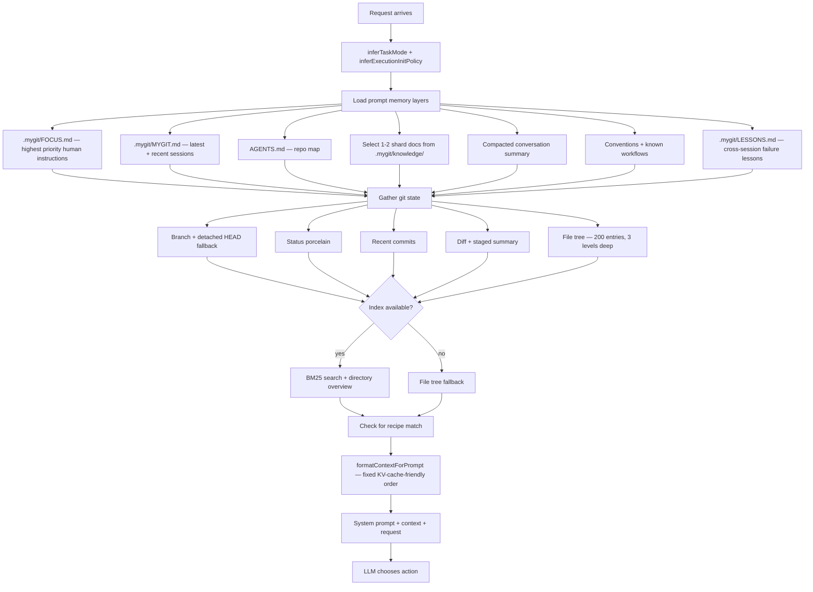
```mermaid
flowchart TD
    A[Request arrives] --> B[inferTaskMode + inferExecutionInitPolicy]
    B --> C[Load prompt memory layers]
    C --> C1[.mygit/FOCUS.md — highest priority human instructions]
    C --> C2[.mygit/MYGIT.md — latest + recent sessions]
    C --> C3[AGENTS.md — repo map]
    C --> C4[Select 1-2 shard docs from .mygit/knowledge/]
    C --> C5[Compacted conversation summary]
    C --> C6[Conventions + known workflows]
    C --> C7[.mygit/LESSONS.md — cross-session failure lessons]

    C1 & C2 & C3 & C4 & C5 & C6 & C7 --> D[Gather git state]
    D --> D1[Branch + detached HEAD fallback]
    D --> D2[Status porcelain]
    D --> D3[Recent commits]
    D --> D4[Diff + staged summary]
    D --> D5[File tree — 200 entries, 3 levels deep]

    D1 & D2 & D3 & D4 & D5 --> E{Index available?}
    E -->|yes| F[BM25 search + directory overview]
    E -->|no| G[File tree fallback]

    F & G --> H[Check for recipe match]
    H --> I[formatContextForPrompt — fixed KV-cache-friendly order]
    I --> J[System prompt + context + request]
    J --> K[LLM chooses action]
```

## Prompt Memory Order

`formatContextForPrompt()` emits memory in a fixed order optimized for KV-cache reuse:

```text
1. FOCUS.md                                     ← STABLE (human-authored)
2. MYGIT.md latest block                        ← STABLE (between checkpoints)
3. Newest recent-session lines                   ← STABLE
4. AGENTS.md                                     ← STABLE
5. Selected .mygit/knowledge/*.md shard docs     ← STABLE (per request)
6. Compacted conversation summary                ← SEMI-STABLE
7. Conventions                                   ← SEMI-STABLE
8. Known workflows                               ← SEMI-STABLE
9. Cross-session lessons                         ← STABLE
10. RAG summaries                                ← SEMI-STABLE
11. Directory overview                           ← SEMI-STABLE
12. Git state (branch, status, diffs, tree)      ← VOLATILE
13. Observations (last 5-10 actions)             ← VOLATILE
14. User request                                 ← VOLATILE
```

Stable layers share the same KV-cache prefix across turns.

### Memory Budgets by Task Mode

| Budget | `direct_qa` | `execution` |
| --- | --- | --- |
| Memory chars | 450–1500 | 900–3600 |
| Output truncation | 140 chars | 200 chars |
| Read context | 600 chars | 1200 chars |
| File tree entries | 20 | 50 |
| Observation window | 10 | 10 |

## Inspect-First Rules

The system prompt in `protocol.ts` tells the model to:

- Use preloaded memory, `AGENTS.md`, selected shard docs, and repo context first
- Prefer one `fetch_context` before any file read
- Use a single targeted `read_file` only if still blocked
- Avoid broad startup harvests

---

## Flow 3: Session Memory Checkpoints

`.mygit/MYGIT.md` is the canonical working-memory file for the repo.

`AGENTS.md` is the canonical repo map entrypoint. It stays short and points to deterministic shard docs in `.mygit/knowledge/`.

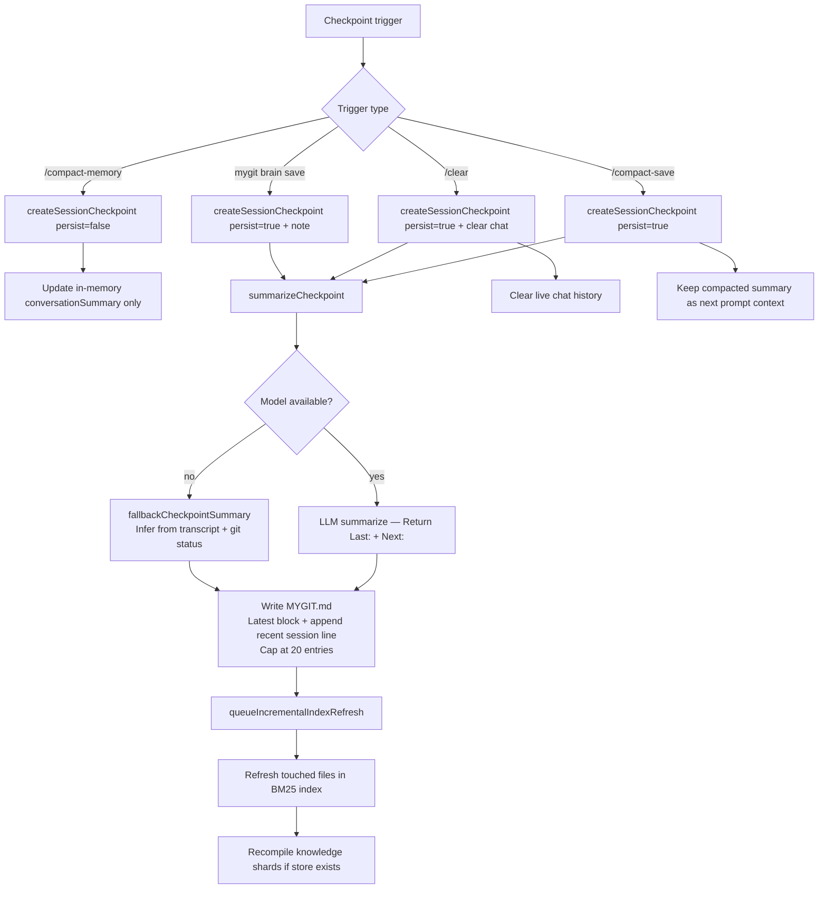
```mermaid
flowchart TD
    A[Checkpoint trigger] --> B{Trigger type}
    B -->|/compact-memory| C[createSessionCheckpoint persist=false]
    B -->|/compact-save| D[createSessionCheckpoint persist=true]
    B -->|/clear| E[createSessionCheckpoint persist=true + clear chat]
    B -->|mygit brain save| F[createSessionCheckpoint persist=true + note]

    C --> G[Update in-memory conversationSummary only]
    D & E & F --> H[summarizeCheckpoint]
    H --> H1{Model available?}
    H1 -->|yes| H2[LLM summarize — Return Last: + Next:]
    H1 -->|no| H3[fallbackCheckpointSummary\nInfer from transcript + git status]

    H2 & H3 --> I[Write MYGIT.md\nLatest block + append recent session line\nCap at 20 entries]
    I --> J[queueIncrementalIndexRefresh]
    J --> K[Refresh touched files in BM25 index]
    K --> L[Recompile knowledge shards if store exists]

    E --> M[Clear live chat history]
    D --> N[Keep compacted summary as next prompt context]
```

## Canonical Memory File Shape

```markdown
# mygit Project Memory

## Latest
Last: ...
Next: ...

## Recent Sessions
- 2026-03-07T12:34:56Z [branch] ...
```

## Important Memory Semantics

- `/clear` clears live conversation history, not durable project memory
- `/compact-memory` does not persist to disk
- `/compact-save` persists and also keeps the summary in the next prompt context
- `mygit brain resume` reads `MYGIT.md`
- `brain.json` is legacy import-only, not a primary runtime source

---

## Flow 4: Full Index Build And Incremental Auto Refresh

mygit has two RAG update paths: explicit indexing and background touched-file refresh.

### Explicit Index Build

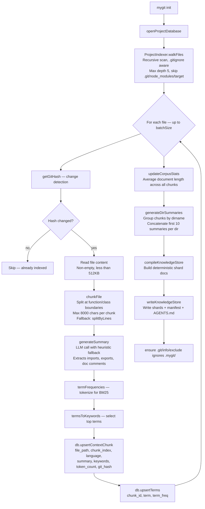
```mermaid
flowchart TD
    A[mygit init] --> B[openProjectDatabase]
    B --> C[ProjectIndexer.walkFiles\nRecursive scan, .gitignore aware\nMax depth 5, skip .git/node_modules/target]
    C --> D{For each file — up to batchSize}
    D --> E[getGitHash — change detection]
    E --> F{Hash changed?}
    F -->|no| G[Skip — already indexed]
    F -->|yes| H[Read file content\nNon-empty, less than 512KB]
    H --> I[chunkFile\nSplit at function/class boundaries\nMax 8000 chars per chunk\nFallback: splitByLines]
    I --> J[generateSummary\nLLM call with heuristic fallback\nExtracts imports, exports, doc comments]
    J --> K[termFrequencies — tokenize for BM25]
    K --> L[termsToKeywords — select top terms]
    L --> M[db.upsertContextChunk\nfile_path, chunk_index, language,\nsummary, keywords, token_count, git_hash]
    M --> N[db.upsertTerms\nchunk_id, term, term_freq]
    N --> D
    D --> O[updateCorpusStats\nAverage document length across all chunks]
    O --> P[generateDirSummaries\nGroup chunks by dirname\nConcatenate first 10 summaries per dir]
    P --> Q[compileKnowledgeStore\nBuild deterministic shard docs]
    Q --> R[writeKnowledgeStore\nWrite shards + manifest + AGENTS.md]
    R --> S[ensure .git/info/exclude ignores .mygit/]
```

### Background Auto Refresh

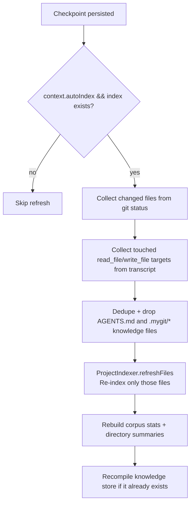
```mermaid
flowchart TD
    A[Checkpoint persisted] --> B{context.autoIndex && index exists?}
    B -->|no| C[Skip refresh]
    B -->|yes| D[Collect changed files from git status]
    D --> E[Collect touched read_file/write_file targets from transcript]
    E --> F[Dedupe + drop AGENTS.md and .mygit/* knowledge files]
    F --> G[ProjectIndexer.refreshFiles\nRe-index only those files]
    G --> H[Rebuild corpus stats + directory summaries]
    H --> I[Recompile knowledge store if it already exists]
```

## Retrieval Path During A Request

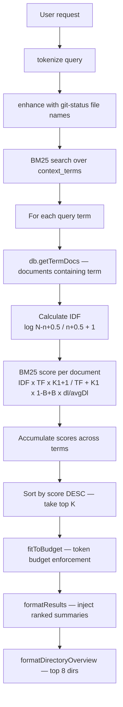
```mermaid
flowchart TD
    A[User request] --> B[tokenize query]
    B --> C[enhance with git-status file names]
    C --> D[BM25 search over context_terms]

    D --> E[For each query term]
    E --> F[db.getTermDocs — documents containing term]
    F --> G[Calculate IDF\nlog N-n+0.5 / n+0.5 + 1]
    G --> H[BM25 score per document\nIDF x TF x K1+1 / TF + K1 x 1-B+B x dl/avgDl]
    H --> I[Accumulate scores across terms]

    I --> J[Sort by score DESC — take top K]
    J --> K[fitToBudget — token budget enforcement]
    K --> L[formatResults — inject ranked summaries]
    L --> M[formatDirectoryOverview — top 8 dirs]
```

### BM25 Parameters

| Parameter | Value | Purpose |
| --- | --- | --- |
| K1 | 1.2 | Term frequency saturation |
| B | 0.75 | Document length normalization |
| Default topK | 5 | Results per query |
| contextBudgetRatio | 0.25 | RAG fraction of available tokens |

---

## Flow 5: Knowledge Compilation

The knowledge compiler generates deterministic shard documents from the indexed codebase:

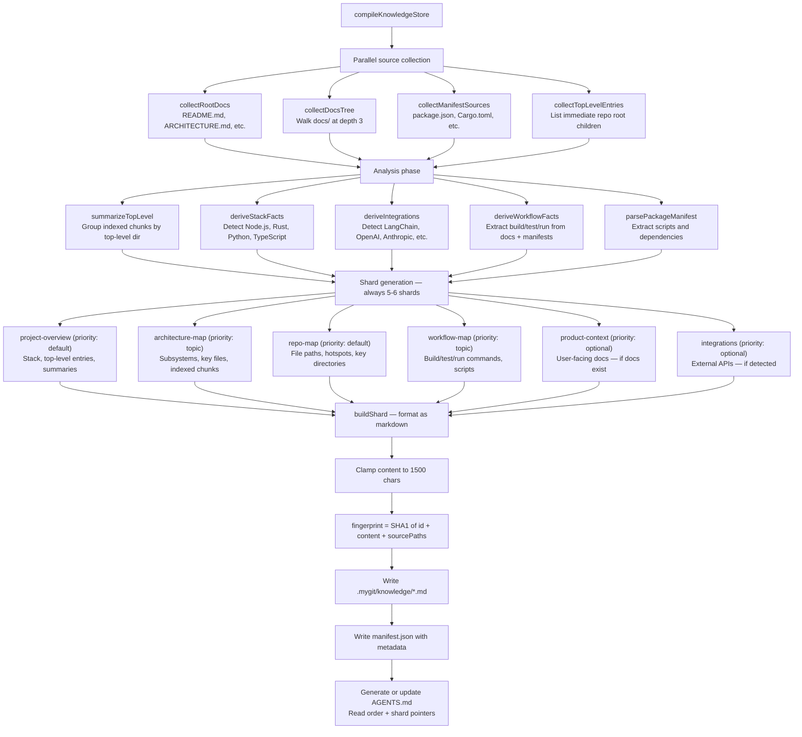
```mermaid
flowchart TD
    A[compileKnowledgeStore] --> B[Parallel source collection]
    B --> B1[collectRootDocs\nREADME.md, ARCHITECTURE.md, etc.]
    B --> B2[collectDocsTree\nWalk docs/ at depth 3]
    B --> B3[collectManifestSources\npackage.json, Cargo.toml, etc.]
    B --> B4[collectTopLevelEntries\nList immediate repo root children]

    B1 & B2 & B3 & B4 --> C[Analysis phase]
    C --> C1[summarizeTopLevel\nGroup indexed chunks by top-level dir]
    C --> C2[deriveStackFacts\nDetect Node.js, Rust, Python, TypeScript]
    C --> C3[deriveIntegrations\nDetect LangChain, OpenAI, Anthropic, etc.]
    C --> C4[deriveWorkflowFacts\nExtract build/test/run from docs + manifests]
    C --> C5[parsePackageManifest\nExtract scripts and dependencies]

    C1 & C2 & C3 & C4 & C5 --> D[Shard generation — always 5-6 shards]
    D --> D1["project-overview (priority: default)\nStack, top-level entries, summaries"]
    D --> D2["architecture-map (priority: topic)\nSubsystems, key files, indexed chunks"]
    D --> D3["repo-map (priority: default)\nFile paths, hotspots, key directories"]
    D --> D4["workflow-map (priority: topic)\nBuild/test/run commands, scripts"]
    D --> D5["product-context (priority: optional)\nUser-facing docs — if docs exist"]
    D --> D6["integrations (priority: optional)\nExternal APIs — if detected"]

    D1 & D2 & D3 & D4 & D5 & D6 --> E[buildShard — format as markdown]
    E --> F[Clamp content to 1500 chars]
    F --> G[fingerprint = SHA1 of id + content + sourcePaths]
    G --> H[Write .mygit/knowledge/*.md]
    H --> I[Write manifest.json with metadata]
    I --> J[Generate or update AGENTS.md\nRead order + shard pointers]
```

### Shard Selection Scoring

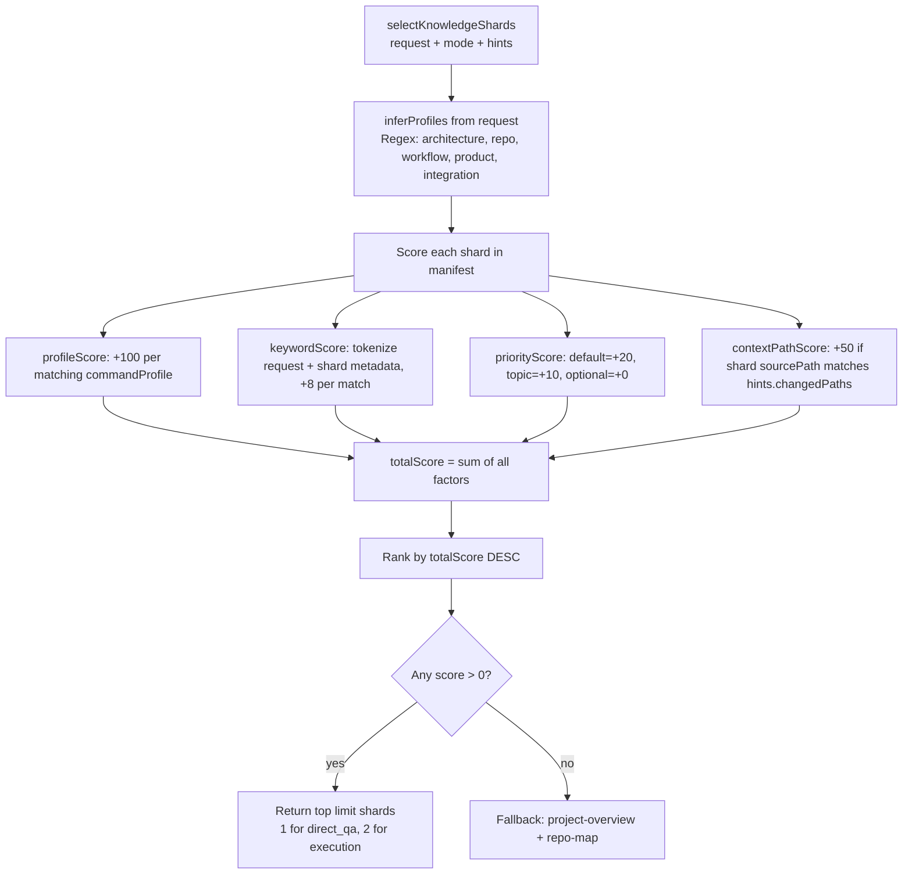
```mermaid
flowchart TD
    A[selectKnowledgeShards\nrequest + mode + hints] --> B[inferProfiles from request\nRegex: architecture, repo, workflow, product, integration]
    B --> C[Score each shard in manifest]

    C --> D["profileScore: +100 per matching commandProfile"]
    C --> E["keywordScore: tokenize request + shard metadata, +8 per match"]
    C --> F["priorityScore: default=+20, topic=+10, optional=+0"]
    C --> G["contextPathScore: +50 if shard sourcePath matches hints.changedPaths"]

    D & E & F & G --> H[totalScore = sum of all factors]
    H --> I[Rank by totalScore DESC]
    I --> J{Any score > 0?}
    J -->|yes| K[Return top limit shards\n1 for direct_qa, 2 for execution]
    J -->|no| L["Fallback: project-overview + repo-map"]
```

---

## Flow 6: Permissions And Execution

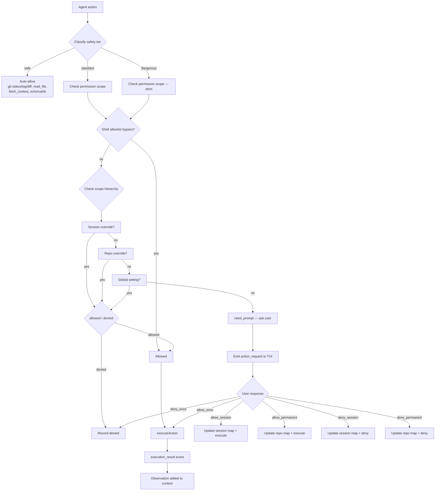
```mermaid
flowchart TD
    A[Agent action] --> B{Classify safety tier}
    B -->|safe| C[Auto-allow\ngit status/log/diff, read_file,\nfetch_context, echo/cat/ls]
    B -->|standard| D[Check permission scope]
    B -->|dangerous| E[Check permission scope — strict]

    D & E --> F{Shell allowlist bypass?}
    F -->|yes| G[Allowed]
    F -->|no| H{Check scope hierarchy}

    H --> H1[Session override?]
    H1 -->|yes| I{allowed / denied}
    H1 -->|no| H2[Repo override?]
    H2 -->|yes| I
    H2 -->|no| H3[Global setting?]
    H3 -->|yes| I
    H3 -->|no| J[need_prompt — ask user]

    I -->|allowed| G
    I -->|denied| K[Record denied]
    G --> L[executeAction]
    L --> M[execution_result event]
    M --> N[Observation added to context]

    J --> O[Emit action_request to TUI]
    O --> P{User response}
    P -->|allow_once| L
    P -->|allow_session| Q[Update session map + execute]
    P -->|allow_permanent| R[Update repo map + execute]
    P -->|deny_once| K
    P -->|deny_session| S[Update session map + deny]
    P -->|deny_permanent| T[Update repo map + deny]
```

### Safety Classification Table

| Tier | Category | Examples |
| --- | --- | --- |
| Safe | — | `git status`, `git log`, `git diff`, `read_file`, `fetch_context`, `echo`, `cat`, `ls` |
| Standard | shell_commands | Non-destructive shell commands |
| Standard | file_writes | `write_file` to non-`.git`/`.lock` paths |
| Standard | — | `git commit`, `git merge`, `git reset` (soft) |
| Dangerous | destructive_git | `git push --force`, `git reset --hard` |
| Dangerous | file_writes | Writes to `.git/` or `.lock` files |
| Dangerous | shell_commands | `rm`, `mv`, destructive shell commands |

## Execution Surface

`executeAction()` supports:

- `git`
- `shell`
- `read_file`
- `write_file`

Terminal-only actions (`respond`, `done`, `clarify`, `plan`, `message`) are handled inside the graph without executor I/O.

---

## Flow 7: Harness Engineering

### Cross-Session Failure Lessons

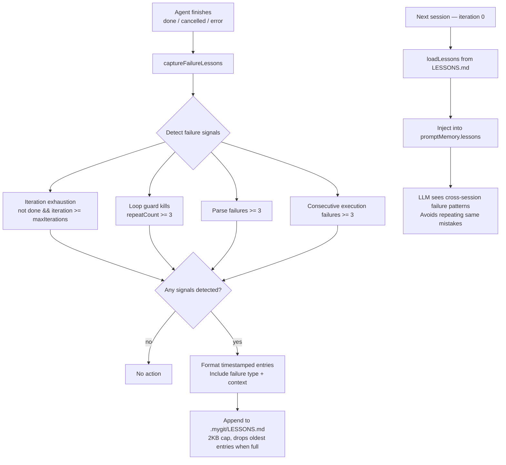
```mermaid
flowchart TD
    A[Agent finishes\ndone / cancelled / error] --> B[captureFailureLessons]
    B --> C{Detect failure signals}
    C --> C1[Iteration exhaustion\nnot done && iteration >= maxIterations]
    C --> C2[Loop guard kills\nrepeatCount >= 3]
    C --> C3[Parse failures >= 3]
    C --> C4[Consecutive execution failures >= 3]

    C1 & C2 & C3 & C4 --> D{Any signals detected?}
    D -->|no| E[No action]
    D -->|yes| F[Format timestamped entries\nInclude failure type + context]
    F --> G[Append to .mygit/LESSONS.md\n2KB cap, drops oldest entries when full]

    H[Next session — iteration 0] --> I[loadLessons from LESSONS.md]
    I --> J[Inject into promptMemory.lessons]
    J --> K[LLM sees cross-session failure patterns\nAvoids repeating same mistakes]
```

### Knowledge Staleness Detection

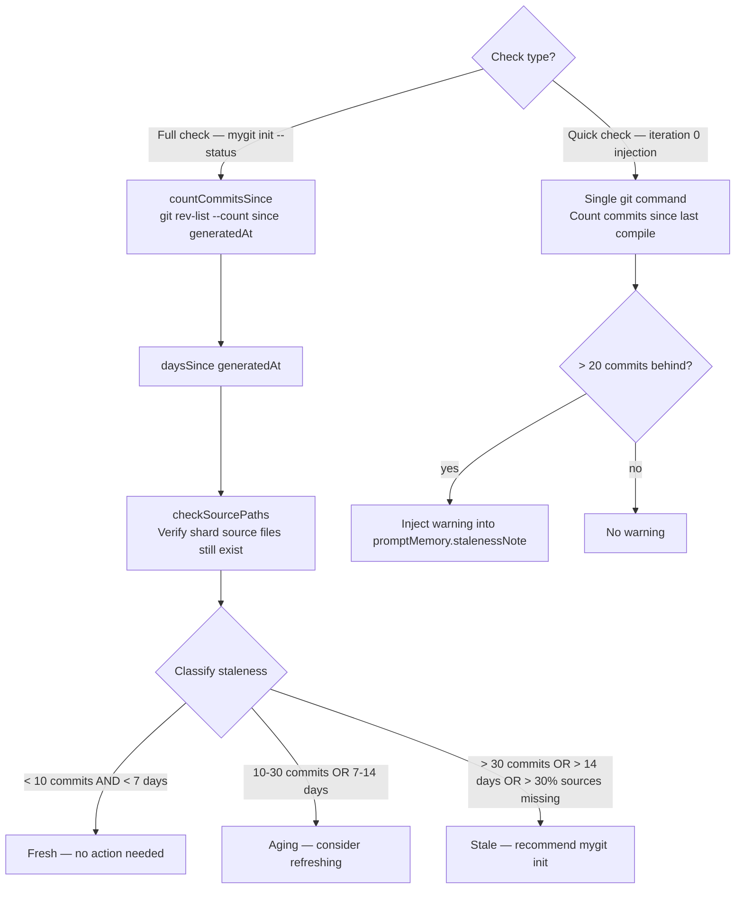
```mermaid
flowchart TD
    A{Check type?}

    A -->|Full check — mygit init --status| B[countCommitsSince\ngit rev-list --count since generatedAt]
    B --> C[daysSince generatedAt]
    C --> D[checkSourcePaths\nVerify shard source files still exist]
    D --> E{Classify staleness}
    E -->|< 10 commits AND < 7 days| F["Fresh — no action needed"]
    E -->|10-30 commits OR 7-14 days| G["Aging — consider refreshing"]
    E -->|> 30 commits OR > 14 days OR > 30% sources missing| H["Stale — recommend mygit init"]

    A -->|Quick check — iteration 0 injection| I[Single git command\nCount commits since last compile]
    I --> J{> 20 commits behind?}
    J -->|yes| K["Inject warning into promptMemory.stalenessNote"]
    J -->|no| L[No warning]
```

---

## Flow 8: Thought Map Mode

Thought map mode is a planning-first path separate from the normal agent loop, but it reuses the same context formatting.

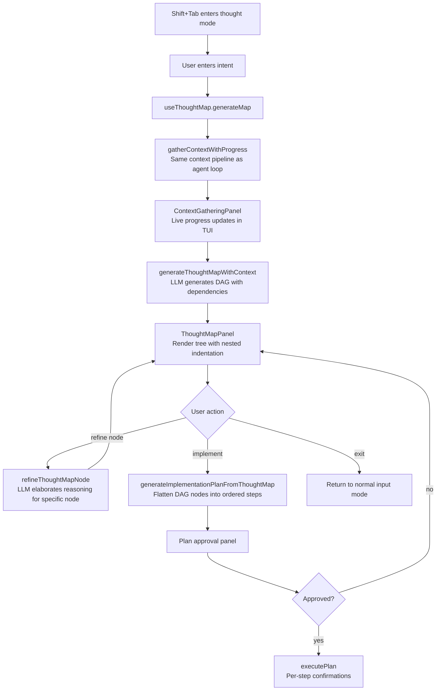
```mermaid
flowchart TD
    A[Shift+Tab enters thought mode] --> B[User enters intent]
    B --> C[useThoughtMap.generateMap]
    C --> D[gatherContextWithProgress\nSame context pipeline as agent loop]
    D --> E[ContextGatheringPanel\nLive progress updates in TUI]
    E --> F[generateThoughtMapWithContext\nLLM generates DAG with dependencies]
    F --> G[ThoughtMapPanel\nRender tree with nested indentation]

    G --> H{User action}
    H -->|refine node| I[refineThoughtMapNode\nLLM elaborates reasoning for specific node]
    I --> G
    H -->|implement| J[generateImplementationPlanFromThoughtMap\nFlatten DAG nodes into ordered steps]
    J --> K[Plan approval panel]
    K --> L{Approved?}
    L -->|yes| M[executePlan\nPer-step confirmations]
    L -->|no| G
    H -->|exit| N[Return to normal input mode]
```

### ThoughtMapNode Structure

```typescript
interface ThoughtMapNode {
    id: string;
    title: string;
    description: string;
    reasoning: string;
    dependencies: string[];  // IDs of prerequisite nodes
    children: ThoughtMapNode[];
    status: "draft" | "maturing" | "mature" | "blocked";
    depth: number;
    safetyNote?: string;     // Risk warning
    command?: string;        // Optional shell/git command
}
```

## Why Thought Map Exists

- Gives the user a plan-first supervision surface
- Makes multi-step work visible before execution
- Keeps context gathering explicit and predictable

---

## Flow 9: PR Review

PR review has its own acquisition, analysis, cache, and posting pipeline.

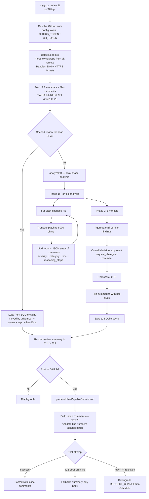
```mermaid
flowchart TD
    A[mygit pr review N\nor TUI /pr] --> B[Resolve GitHub auth\nconfig token / GITHUB_TOKEN / GH_TOKEN]
    B --> C[detectRepoInfo\nParse owner/repo from git remote\nHandles SSH + HTTPS formats]
    C --> D[Fetch PR metadata + files + commits\nvia GitHub REST API v2022-11-28]
    D --> E{Cached review for head SHA?}
    E -->|yes| F[Load from SQLite cache\nKeyed by prNumber + owner + repo + headSha]
    E -->|no| G[analyzePR — Two-phase analysis]

    G --> H[Phase 1: Per-file analysis]
    H --> H1[For each changed file]
    H1 --> H2[Truncate patch to 8000 chars]
    H2 --> H3[LLM returns JSON array of comments\nseverity + category + line + reasoning_steps]
    H3 --> H1

    H --> I[Phase 2: Synthesis]
    I --> I1[Aggregate all per-file findings]
    I1 --> I2[Overall decision: approve / request_changes / comment]
    I2 --> I3[Risk score: 0-10]
    I3 --> I4[File summaries with risk levels]

    I4 --> J[Save to SQLite cache]
    F & J --> K[Render review summary in TUI or CLI]
    K --> L{Post to GitHub?}
    L -->|no| M[Display only]
    L -->|yes| N[prepareInlineCapableSubmission]
    N --> O[Build inline comments — max 25\nValidate line numbers against patch]
    O --> P{Post attempt}
    P -->|success| Q[Posted with inline comments]
    P -->|422 error on inline| R[Fallback: summary-only body]
    P -->|own PR rejection| S[Downgrade REQUEST_CHANGES to COMMENT]
```

### Review Comment Categories

| Category | Examples |
| --- | --- |
| bug | Logic errors, null references |
| security | Injection, auth bypasses |
| performance | N+1 queries, unnecessary allocations |
| style | Naming, formatting |
| logic | Control flow issues |
| docs | Missing/wrong documentation |
| test | Test coverage gaps |

### PR Persistence

PR results are cached in `.mygit/mygit.db` keyed by (PR number, repo owner/name, head SHA). This makes repeated reviews fast and safe to reuse until the PR head changes.

---

## Flow 10: Merge Conflict Handling

There are two main conflict paths: explicit conflict work and push-rejection recovery.

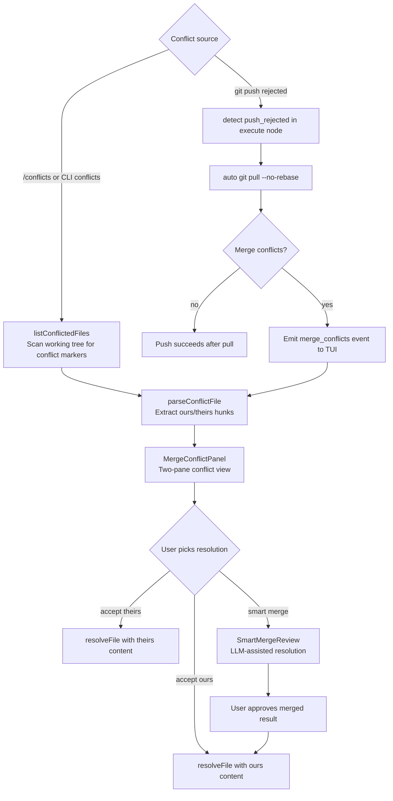
```mermaid
flowchart TD
    A{Conflict source}
    A -->|/conflicts or CLI conflicts| B[listConflictedFiles\nScan working tree for conflict markers]
    A -->|git push rejected| C[detect push_rejected in execute node]
    C --> D[auto git pull --no-rebase]
    D --> E{Merge conflicts?}
    E -->|no| F[Push succeeds after pull]
    E -->|yes| G[Emit merge_conflicts event to TUI]

    B & G --> H[parseConflictFile\nExtract ours/theirs hunks]
    H --> I[MergeConflictPanel\nTwo-pane conflict view]
    I --> J{User picks resolution}
    J -->|accept ours| K[resolveFile with ours content]
    J -->|accept theirs| L[resolveFile with theirs content]
    J -->|smart merge| M[SmartMergeReview\nLLM-assisted resolution]
    M --> N[User approves merged result]
    N --> K
```

---

## Flow 11: Git Recipe System

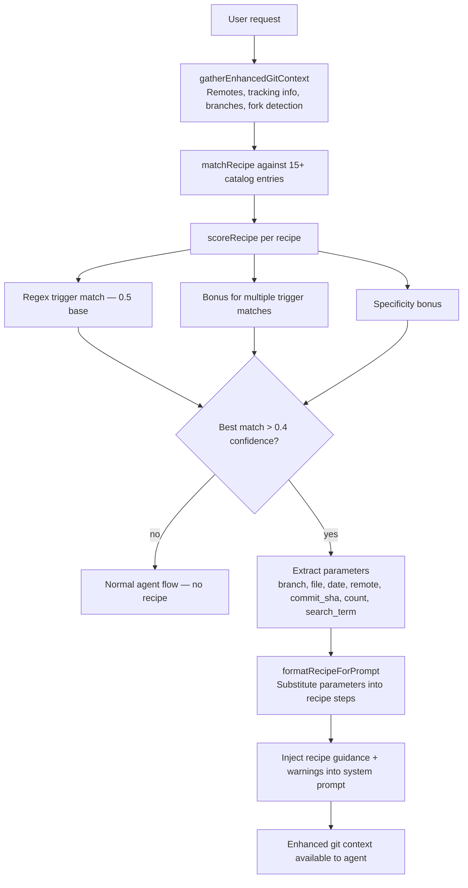
```mermaid
flowchart TD
    A[User request] --> B[gatherEnhancedGitContext\nRemotes, tracking info, branches, fork detection]
    B --> C[matchRecipe against 15+ catalog entries]
    C --> D[scoreRecipe per recipe]
    D --> D1[Regex trigger match — 0.5 base]
    D --> D2[Bonus for multiple trigger matches]
    D --> D3[Specificity bonus]
    D1 & D2 & D3 --> E{Best match > 0.4 confidence?}
    E -->|no| F[Normal agent flow — no recipe]
    E -->|yes| G[Extract parameters\nbranch, file, date, remote, commit_sha, count, search_term]
    G --> H[formatRecipeForPrompt\nSubstitute parameters into recipe steps]
    H --> I[Inject recipe guidance + warnings into system prompt]
    I --> J[Enhanced git context available to agent]
```

### Recipe Categories

| Category | Count | Examples |
| --- | --- | --- |
| cross_repo | 5 | fetch-remote-branch, sync-fork, cherry-pick-cross-remote |
| history | 8 | undo-file-to-date, restore-deleted-file, bisect-bug, squash-commits |
| search | 4 | find-in-history, find-commit-by-message, find-deleted-content |
| branch | 4 | create-feature-branch, rename-branch, sync-local-with-remote |
| setup | 2 | clone-fork, initial-setup |

---

## Flow 12: Event Bus Architecture

```mermaid
flowchart LR
    subgraph Agent Graph
        A1[gatherContext]
        A2[callLLM]
        A3[execute]
        A4[handleTerminal]
        A5[fetchContext]
    end

    subgraph Event Bus
        E[AgentEventBus\nTyped pub/sub]
    end

    subgraph TUI — useAgent hook
        T1[messages array]
        T2[pendingConfirm]
        T3[pendingClarify]
        T4[pendingPlan]
        T5[pendingMergeConflicts]
        T6[tokenUsage]
        T7[iteration counter]
        T8[isThinking flag]
    end

    A1 -->|iteration| E
    A2 -->|thinking + token_usage| E
    A3 -->|action + execution_result| E
    A3 -->|merge_conflicts| E
    A4 -->|message / response / task_complete| E
    A4 -->|clarify_request / plan_proposal| E
    A5 -->|context_fetch| E

    E --> T1
    E --> T2
    E --> T3
    E --> T4
    E --> T5
    E --> T6
    E --> T7
    E --> T8
```

---

## Flow 13: TUI Mode State Machine

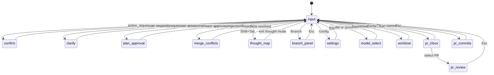
```mermaid
stateDiagram-v2
    [*] --> input

    input --> confirm: action_request event
    input --> clarify: clarify_request event
    input --> plan_approval: plan_proposal event
    input --> merge_conflicts: merge_conflicts event
    input --> thought_map: Shift+Tab
    input --> branch_panel: /branch
    input --> settings: /config
    input --> model_select: /model or /provider
    input --> worktree: /worktrees
    input --> pr_inbox: /pr
    input --> pr_commits: /pr-commits

    confirm --> input: user responds
    clarify --> input: user answers
    plan_approval --> input: user approves/rejects
    merge_conflicts --> input: conflicts resolved
    thought_map --> input: exit thought mode
    branch_panel --> input: Esc
    settings --> input: Esc
    model_select --> input: Esc
    worktree --> input: Esc
    pr_inbox --> pr_review: select PR
    pr_inbox --> input: Esc
    pr_review --> input: Esc
    pr_commits --> input: Esc
```

---

## Persistence Map

| Surface | Location | Purpose |
| --- | --- | --- |
| Root agent map | `AGENTS.md` | Tracked repo map and shard entrypoint |
| Repo-local database | `.mygit/mygit.db` | BM25 index, conventions, workflows, operations, PR cache |
| Repo-local knowledge store | `.mygit/knowledge/manifest.json`, `.mygit/knowledge/*.md` | Generated shard registry and deterministic repo docs |
| Repo-local working memory | `.mygit/MYGIT.md` | Latest + recent session summary for prompt reuse |
| Manual focus file | `.mygit/FOCUS.md` | Highest-priority human-authored instructions |
| Failure lessons | `.mygit/LESSONS.md` | Cross-session failure patterns (2KB cap) |
| Repo config | `.mygit/config.toml` | Project-level overrides |
| Global config | Platform config dir | User defaults across repos |

---

## Database Schema

```sql
-- BM25 inverted index
CREATE TABLE context_index (
    id INTEGER PRIMARY KEY,
    file_path TEXT NOT NULL,
    chunk_index INTEGER NOT NULL,
    language TEXT,
    summary TEXT NOT NULL,
    keywords TEXT,
    token_count INTEGER,
    git_hash TEXT,
    last_indexed TIMESTAMP,
    UNIQUE(file_path, chunk_index)
);

CREATE TABLE context_terms (
    id INTEGER PRIMARY KEY,
    chunk_id INTEGER NOT NULL,
    term TEXT NOT NULL,
    term_freq INTEGER NOT NULL,
    FOREIGN KEY(chunk_id) REFERENCES context_index(id)
);

CREATE TABLE context_dir_index (
    id INTEGER PRIMARY KEY,
    dir_path TEXT NOT NULL UNIQUE,
    summary TEXT NOT NULL,
    child_count INTEGER,
    last_indexed TIMESTAMP
);

CREATE TABLE context_corpus_stats (
    total_docs INTEGER,
    avg_doc_length REAL,
    last_updated TIMESTAMP
);
```

---

## Failure And Guardrails

| Risk | Guardrail |
| --- | --- |
| Malformed LLM JSON | Parse retry with escalating feedback |
| Repeated reads/fetches | Loop guard in `graph.ts` |
| Prompt bloat | Token budget, compacted history, truncated memory blocks |
| Destructive actions | Permission tiers + prompts |
| Stale RAG / knowledge | Explicit `mygit init` + async touched-file refresh + staleness detection |
| Cross-session failures | Lesson capture to `LESSONS.md` for learning |
| Slow session persistence | Checkpoint fallback path and best-effort refresh |

---

## Where To Read Next

- [README.md](../README.md): user-facing overview and command surface
- [docs/development.md](./development.md): contributor guide and module ownership
- [docs/configuration.md](./configuration.md): config hierarchy and options
- [src-ts/docs/agent-loop.md](../src-ts/docs/agent-loop.md): focused agent-loop reference
- [benchmarks/README.md](../benchmarks/README.md): benchmark taxonomy and scoring
