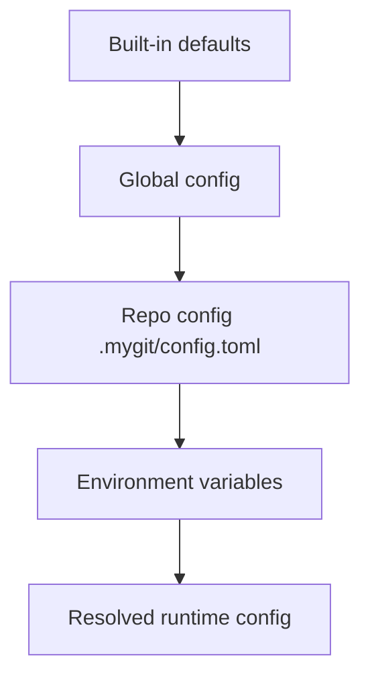
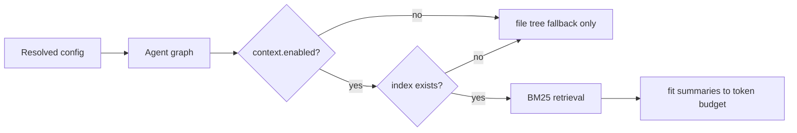

# Configuration Reference

mygit uses TOML configuration with layered overrides.

---

## Resolution Order



## File Locations

| Scope | Path |
| --- | --- |
| Global macOS | `~/Library/Application Support/mygit/config.toml` |
| Global Linux | `~/.config/mygit/config.toml` |
| Repo-local | `.mygit/config.toml` |

Manage them with:

```bash
mygit config show
mygit config init
mygit config init --local
mygit config edit
mygit config edit --local
mygit setup
```

---

## Minimal Example

```toml
provider = "ollama"

[ollama]
url = "http://localhost:11434"
model = "qwen2.5-coder:7b"
temperature = 0.4
contextWindow = 16384

[agent]
automationLevel = "safe"
maxIterations = 15
showThinking = false
planningMode = "show_and_approve"

[context]
enabled = true
autoIndex = true
retrievalTopK = 5
contextBudgetRatio = 0.25
```

---

## Top-Level Settings

```toml
provider = "ollama"
```

Supported providers:

- `ollama`
- `google`
- `api`
- `transformer`

---

## Provider Sections

### `[ollama]`

```toml
[ollama]
url = "http://localhost:11434"
model = "qwen2.5-coder:7b"
temperature = 0.4
contextWindow = 16384
```

### `[google]`

```toml
[google]
apiKey = "..."
model = "gemini-2.0-flash"
```

### `[api]`

```toml
[api]
activeService = "openai"

[api.apiKeys]
openai = "..."
anthropic = "..."
deepseek = "..."
groq = "..."
cerebras = "..."
openrouter = "..."
moonshot = "..."
gemini = "..."

[api.models]
openai = "gpt-4o"
anthropic = "claude-sonnet-4-6"
deepseek = "deepseek-chat"
```

### `[transformer]`

```toml
[transformer]
model = "ByteDance/Ouro-2.6B"
serverUrl = "http://localhost:8080"
temperature = 0.4
```

---

## Agent Settings

```toml
[agent]
automationLevel = "safe"
maxIterations = 15
showThinking = false
planningMode = "show_and_approve"

[agent.permissions]
shellCommands = "ask"
fileWrites = "ask"
destructiveGit = "ask"

[agent.shell]
allowlist = ["git status", "git log", "git diff", "ls", "cat"]
```

### Important fields

| Field | Meaning |
| --- | --- |
| `automationLevel` | overall approval posture: `safe`, `semi_autonomous`, `extreme` |
| `maxIterations` | hard cap for one agent run |
| `showThinking` | render model `<think>` output in TUI |
| `planningMode` | how plan proposals are handled |
| `agent.permissions.*` | default approval behavior by action category |
| `agent.shell.allowlist` | shell prefixes that bypass prompt checks |

---

## UI Settings

```toml
[ui]
theme = "nebula_pulse"
mouseEnabled = true
```

Supported themes:

- `nebula_pulse`
- `graphite_mist`
- `ghost_glass`

---

## Context / RAG Settings

```toml
[context]
enabled = true
autoIndex = true
retrievalTopK = 5
contextBudgetRatio = 0.25
```

### Context Flow



### What `autoIndex` means now

`autoIndex = true` does **not** trigger a full repo reindex on every run.

It enables background touched-file refresh after checkpoint events such as:

- `/compact save`
- `/clear`
- `mygit brain save`

That refresh only runs when an index already exists. When the repo already has a knowledge store, the same background pass also recompiles `.mygit/knowledge/*.md` deterministically. Full indexing and AGENTS regeneration still happen through:

```bash
mygit init
```

---

## Learning / Smart Merge / GitHub

```toml
[learning]
enabled = true
minFrequency = 3
confidenceThreshold = 0.6
memoryScope = "repo"

[smartMerge]
enabled = true

[github]
token = ""
apiUrl = "https://api.github.com"
defaultOwner = ""
defaultRepo = ""
reviewAutoPost = false
reviewPostMinSeverity = "major"
prInboxDefaultState = "all"
```

### Notes

- `learning` controls convention + workflow recall
- `smartMerge.enabled` controls the smart merge flow
- `github.*` drives PR inbox, review, and posting

---

## Environment Variables

These override config where applicable:

- `ANTHROPIC_API_KEY`
- `OPENAI_API_KEY`
- `GEMINI_API_KEY`
- `DEEPSEEK_API_KEY`
- `GROQ_API_KEY`
- `CEREBRAS_API_KEY`
- `OPENROUTER_API_KEY`
- `MOONSHOT_API_KEY`
- `GITHUB_TOKEN`

---

## Related Docs

- [README.md](../README.md)
- [docs/architecture.md](./architecture.md)
- [docs/development.md](./development.md)
