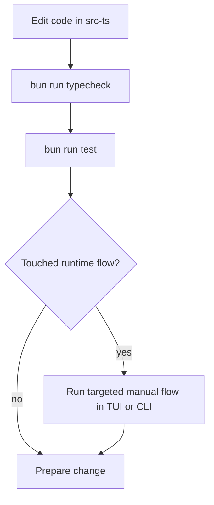
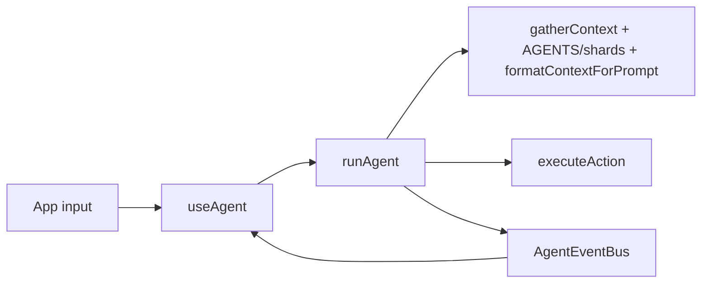
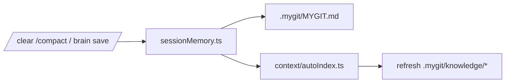
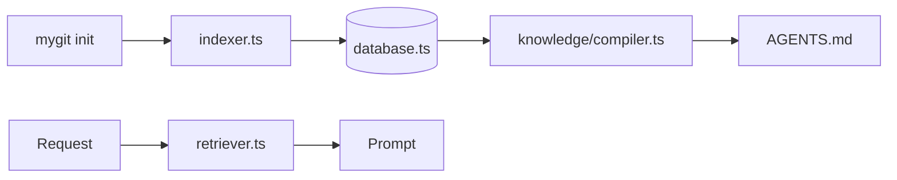

# Development Guide

This guide is for contributors working on the active TypeScript implementation in `src-ts/`.

---

## Setup

```bash
git clone <repo-url>
cd MyGit/src-ts
bun install
```

Useful commands:

```bash
bun run dev
bun run build
bun run typecheck
bun run test
```

If you want repo retrieval enabled while developing against this repo:

```bash
mygit init
```

---

## Contributor Workflow



## Which Files Own Which Flows

| Flow | Main files |
| --- | --- |
| Interactive request execution | `tui/App.tsx`, `tui/hooks/useAgent.ts`, `agent/graph.ts` |
| Prompt construction | `agent/context.ts`, `agent/protocol.ts`, `agent/graph.ts` |
| AGENTS map + knowledge shards | `knowledge/compiler.ts`, `knowledge/store.ts`, `knowledge/selector.ts` |
| Session checkpoint memory | `memory/sessionMemory.ts`, `tui/hooks/useAgent.ts`, `cli/brain.ts` |
| Smart-context indexing and refresh | `context/indexer.ts`, `context/retriever.ts`, `context/autoIndex.ts` |
| Thought map / planning | `tui/hooks/useThoughtMap.ts`, `tui/thoughtMap/*`, `plan/engine.ts` |
| PR review | `cli/pr.ts`, `pr/*`, `github/*` |
| Merge flows | `merge/*`, `tui/components/Merge*` |
| Persistence | `storage/database.ts` |

---

## Module Map

```text
src-ts/
├── index.tsx                 entry point
├── cli/                      commander commands
├── tui/                      React Ink UI
├── agent/                    LangGraph loop + prompt/runtime rules
├── context/                  BM25 indexing, retrieval, auto refresh
├── knowledge/                AGENTS map + deterministic shard compiler
├── memory/                   canonical MYGIT.md checkpoint pipeline
├── executor/                 git/shell/file execution
├── plan/                     plan CLI + execution engine
├── pr/                       PR analysis + cache logic
├── github/                   GitHub API + auth helpers
├── merge/                    conflict parsing and smart resolution
├── learning/                 conventions and workflow retrieval
├── storage/                  SQLite layer
├── conventions/              convention discovery
└── tests/                    Vitest suites
```

---

## Working Flows For Contributors

### 1. Agent Request Flow



Touch these files when changing the core agent path:

- `src-ts/tui/hooks/useAgent.ts`
- `src-ts/agent/graph.ts`
- `src-ts/agent/context.ts`
- `src-ts/agent/protocol.ts`
- `src-ts/executor/index.ts`

### 2. Session Memory Flow



Touch these files when changing memory behavior:

- `src-ts/memory/sessionMemory.ts`
- `src-ts/tui/hooks/useAgent.ts`
- `src-ts/cli/brain.ts`
- `src-ts/agent/graph.ts`

### 3. Retrieval Flow



Touch these files when changing retrieval/index behavior:

- `src-ts/context/indexer.ts`
- `src-ts/context/retriever.ts`
- `src-ts/context/autoIndex.ts`
- `src-ts/storage/database.ts`
- `src-ts/agent/context.ts`

---

## Test Surface

Run everything:

```bash
cd src-ts
bun run test
```

Important suites for the current architecture:

| File | Coverage |
| --- | --- |
| `tests/agentContextFormat.test.ts` | prompt memory ordering and truncation |
| `tests/agentGraphFetchLoop.test.ts` | `fetch_context` loop guard |
| `tests/agentGraphPromptBudget.test.ts` | runtime prompt budgeting |
| `tests/sessionMemory.test.ts` | `MYGIT.md` persistence and legacy import |
| `tests/autoIndex.test.ts` | touched-file refresh gating |
| `tests/knowledgeSelector.test.ts` | shard selection rules |
| `tests/knowledgeStore.test.ts` | AGENTS ownership + deterministic shard writes |
| `tests/useAgentHistoryCompaction.test.ts` | conversation compaction behavior |
| `tests/databasePathConsistency.test.ts` | `.mygit/mygit.db` path expectations |

See [TESTING.md](../TESTING.md) for the full automated and manual coverage map.

---

## Common Tasks

### Add a new agent action

1. update `src-ts/agent/protocol.ts`
2. route it in `src-ts/agent/graph.ts`
3. execute or handle it in `src-ts/executor/index.ts` or terminal handling
4. render the result in `src-ts/tui/hooks/useAgent.ts`
5. add tests

### Change prompt or context behavior

1. update `src-ts/agent/context.ts`
2. update `src-ts/agent/protocol.ts`
3. update `src-ts/agent/graph.ts`
4. update `src-ts/knowledge/*` if the AGENTS or shard contract changes
5. adjust `agentContextFormat` / prompt-budget tests

### Change memory behavior

1. update `src-ts/memory/sessionMemory.ts`
2. update TUI / CLI call sites
3. update checkpoint tests
4. update docs if the `.mygit/MYGIT.md` contract changed

### Change knowledge-map behavior

1. update `src-ts/knowledge/compiler.ts` and `src-ts/knowledge/store.ts`
2. update `src-ts/agent/graph.ts` and `src-ts/agent/context.ts`
3. update `src-ts/context/autoIndex.ts` and `src-ts/cli/index.ts`
4. update the knowledge-store tests and docs

### Change PR flow

1. update `src-ts/github/*`
2. update `src-ts/pr/*`
3. update `src-ts/cli/pr.ts`
4. update TUI review panels if needed

---

## Docs To Keep In Sync

- [README.md](../README.md)
- [docs/architecture.md](./architecture.md)
- [docs/configuration.md](./configuration.md)
- [src-ts/docs/agent-loop.md](../src-ts/docs/agent-loop.md)
- [TESTING.md](../TESTING.md)
